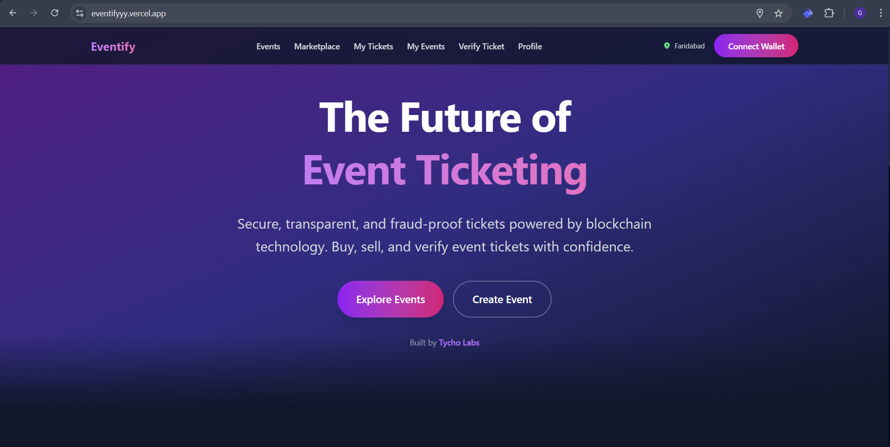

# 🎫 Eventify - Decentralized Event Ticketing Platform



> **Multi-chain event ticketing platform — NFT tickets, secondary marketplace, token-gated communities, wallet dashboard, and royalty management on any EVM chain**

[](https://nextjs.org/)
[](https://soliditylang.org/)
[]()
[](LICENSE)

> Currently live on **Etherlink Shadownet** and **Ethereum Sepolia**, with more chains coming soon.

## 🌟 Overview

Eventify is a multi-chain event ticketing platform for both online and offline events. Whether it's a concert, conference, virtual workshop, or live stream — Eventify handles ticketing, access control, community, and resale with on-chain guarantees on any EVM-compatible chain. The architecture is chain-agnostic: add a new chain by deploying the contracts and dropping the addresses into a config file. Everything else — the frontend, database, verification, marketplace — adapts automatically.

The MVP proves the core loop — mint, buy, sell, verify, chat — all on-chain. The vision is to make Eventify the go-to platform for any event type, and an API layer that lets existing Web2 ticketing systems adopt NFT tickets without a rebuild.

### 🎯 MVP Features (Built)

#### For Event Organizers
- **🎨 NFT Ticket Creation** — Deploy custom ERC-721 ticket contracts with configurable parameters (price, supply, max per wallet, resale caps)
- **💰 Royalty Management** — Earn royalties on secondary sales with flexible splitting among multiple recipients via on-chain RoyaltySplitter contracts
- **📊 Real-time Analytics** — Track ticket sales, revenue, resale volume, and attendee engagement per event
- **🔍 QR Code Verification** — Scan and verify tickets at event entry with multi-chain blockchain validation
- **💬 Token-Gated Chat** — Exclusive real-time chat rooms for ticket holders with reply, edit, delete, and typing indicators
- **📍 Location-Based Discovery** — Events discoverable by proximity and city with configurable radius (10–500 km)
- **🎭 Draft Management** — Save events as drafts and publish when ready
- **👥 Attendee Management** — View attendees grouped by wallet with ticket counts, usage status, and profile info
- **🎟️ Batch Ticket Operations** — Batch mark tickets as used, bulk purchase multiple tickets
- **📸 Media Gallery** — Upload cover images, gallery images, and videos to IPFS via Pinata
- **🌐 Multi-Chain Deployment** — Deploy events on any supported EVM chain (currently Etherlink Shadownet and Sepolia, more coming soon)
- **💸 Fund Withdrawal** — Withdraw ticket sale proceeds directly from event contracts
- **📋 Event Preview** — Preview event details before publishing with full media and metadata display

#### For Attendees
- **🎟️ NFT Tickets** — Own your tickets as blockchain-verified ERC-721 NFTs with on-chain metadata
- **🏪 Secondary Marketplace** — Buy and sell tickets with price cap protection and royalty enforcement
- **💸 Secure Transfers** — Transfer tickets to friends via wallet address or username lookup
- **📱 Digital Wallet Dashboard** — Manage all tickets across chains with filtering by chain, status (all/unlisted/listed), and configurable page sizes
- **🗓️ Calendar Integration** — Filter events by date with visual calendar picker
- **🌍 Location Discovery** — Find events nearby or search by city with distance display
- **👤 User Profiles** — Customizable profiles with username, name, email, contact number, bio, avatar, and QR codes for quick check-in
- **💬 Event Communities** — Join token-gated text chat with other attendees, with full-page chat view and event sidebar
- **📊 Transaction History** — Complete audit trail of all ticket operations (purchases, sales, transfers, listings, cancellations, usage) with chain filtering
- **📥 Ticket Download** — Download tickets as styled PNG or PDF with embedded QR codes for offline verification
- **🔗 Multi-Chain Balances** — View claimable resale earnings across all supported chains
- **💰 Resale Earnings** — Claim funds from marketplace sales per chain with detailed earnings breakdown
- **🎫 Individual Ticket View** — Dedicated ticket detail page with event info, status, QR code, and action buttons

#### Under the Hood
- **🔐 Wallet Authentication** — Secure sign-in with Web3 wallets via message signing, with 24-hour session persistence
- **📸 Media Management** — Upload event images and videos to IPFS via Pinata with group management
- **🌐 Multi-timezone Support** — Events displayed in local timezones with GMT offset picker
- **📊 Transaction History** — Complete audit trail of all ticket operations with chain-aware indexing
- **🎨 Customizable Metadata** — Rich NFT metadata with event details and IPFS-hosted media
- **⚡ Real-time Updates** — Live chat and notifications via Supabase Realtime
- **🔄 Royalty Splitter** — Automated distribution of royalties to multiple recipients via EIP-1167 minimal proxy clones
- **🌍 Geolocation** — Browser-based geolocation with reverse geocoding for city detection in header
- **🔗 Multi-Chain Verification** — Verify tickets across all supported chains with automatic chain detection
- **📄 Event Comments** — Public comment section on event pages with user profiles
- **🛡️ Error Boundary** — Graceful error handling with recovery UI
- **🔍 Username Availability Check** — Real-time username uniqueness validation during profile setup

### 🔭 Vision: Where Eventify Is Headed

| Direction | What it means |
|---|---|
| **Online Events** | Token-gated video and audio rooms (extending the text chat already built), screen sharing, breakout rooms, hybrid event support |
| **Payments** | Card payments and fiat on-ramps so non-crypto users can buy tickets seamlessly |
| **API-as-a-Service** | REST API, SDK, and embeddable widgets so existing Web2 ticketing platforms can add NFT tickets without a rebuild |
| **Smart Wallets** | Embedded wallets auto-created on signup, removing the Web3 onboarding barrier |
| **More Chains** | Chain-agnostic architecture — Avalanche, Polygon, Arbitrum, Base, and any EVM chain can be added by deploying contracts and updating one config file |

---

## 🏗️ Architecture

### Technology Stack

#### Frontend
- **Framework**: Next.js 16.1.6 (React 19.2.3) with App Router
- **Styling**: Tailwind CSS 4
- **Web3**: wagmi 2.19.5, viem 2.45.1, RainbowKit 2.2.10
- **State Management**: TanStack Query 5.90.20
- **Database**: Supabase (PostgreSQL + Realtime)
- **Storage**: Pinata (IPFS) for decentralized media
- **PDF/Image Export**: jsPDF, html2canvas, qrcode
- **QR Scanning**: html5-qrcode
- **Notifications**: react-hot-toast

#### Smart Contracts
- **Language**: Solidity 0.8.25 (with viaIR and optimizer)
- **Framework**: Hardhat 2.13.0
- **Standards**: ERC-721, ERC-2981 (Royalties), EIP-1167 (Minimal Proxies)
- **Libraries**: OpenZeppelin Contracts 4.9.3
- **Patterns**: Factory pattern, Cloneable proxies, Reentrancy guards

#### Blockchain (Multi-Chain, EVM-Compatible)

Eventify is chain-agnostic — deploy the same contract suite to any EVM chain and register it in one config file. Currently live on:

| Network | Chain ID | Currency | Status |
|---|---|---|---|
| Etherlink Shadownet | 127823 | XTZ | ✅ Deployed |
| Ethereum Sepolia | 11155111 | ETH | ✅ Deployed |
| Etherlink Testnet | 128123 | XTZ | Configured |
| Etherlink Mainnet | 42793 | XTZ | Ready |

> Avalanche, Polygon, Arbitrum, Base, and other EVM chains can be added with zero frontend changes.

### Smart Contract Architecture

```
┌─────────────────────────────────────────────────────────────┐
│                      EventFactory                            │
│  - createEvent() / createEventAdvanced()                    │
│  - Deploys EventTicket + RoyaltySplitter clones             │
│  - Manages event registry                                   │
│  - getEventsPaginated(), getMultipleEventInfo()             │
└─────────────────────────────────────────────────────────────┘
                          │
                          ├──────────────────┬─────────────────┐
                          ▼                  ▼                 ▼
              ┌──────────────────┐  ┌──────────────┐  ┌──────────────┐
              │  EventTicket #1  │  │ EventTicket  │  │ EventTicket  │
              │  (ERC-721 NFT)   │  │      #2      │  │      #N      │
              │  - purchaseTicket│  └──────────────┘  └──────────────┘
              │  - purchaseTickets (batch)             
              │  - verifyTicket  │
              │  - markAsUsed / batchMarkAsUsed
              │  - getMaxResalePrice / validateResalePrice
              │  - withdrawFunds │
              │  - getTicketsByOwner
              └──────────────────┘
                          │
                          ▼
              ┌──────────────────────────────────────┐
              │      TicketMarketplace               │
              │  - listTicket (with price cap check) │
              │  - buyTicket (with balance offset)   │
              │  - cancelListing                     │
              │  - claimFunds / claimableFunds       │
              │  - getActiveListings (paginated)     │
              │  - Escrow management                 │
              └──────────────────────────────────────┘
                          │
                          ▼
              ┌──────────────────────────────────────┐
              │      RoyaltySplitter (Clone)         │
              │  - claimAndDistribute()              │
              │  - distribute()                      │
              │  - pendingPayment() per recipient    │
              │  - getRecipients() with shares       │
              │  - totalReleased / released tracking │
              └──────────────────────────────────────┘
```

### Database Schema (10 Tables)

```sql
users                    -- Wallet address, username, name, email, contact, bio, avatar
events                   -- Event metadata, chain_id, contract address, media, location, timezone, event_type
user_tickets             -- Token ownership per chain, usage status, listing status
marketplace_listings     -- Active/sold/cancelled listings per chain with buyer tracking
transactions             -- Complete tx history per chain (purchase, sale, listing, transfer, cancel, use)
royalty_recipients       -- Per-event royalty split config with earned/claimed tracking
royalty_distributions    -- Immutable audit trail of on-chain distributions with per-recipient breakdown
comments                 -- Public event comments with user profiles
chat_messages            -- Token-gated real-time chat with reply, edit, soft-delete support
```

All tables have Row Level Security (RLS) enabled, proper indexes for chain-aware queries, and auto-updating timestamps via triggers.

---

## 🚀 Getting Started

### Prerequisites

- Node.js 20+ and npm
- Git
- MetaMask or compatible Web3 wallet
- Testnet tokens for the target chain (e.g. XTZ for Etherlink Shadownet, ETH for Sepolia)

### Installation

1. **Clone the repository**
```bash
git clone https://github.com/dev-tycholabs/Eventify.git
cd eventify
```

2. **Install frontend dependencies**
```bash
npm install
```

3. **Install smart contract dependencies**
```bash
cd nft-marketplace-Marketplace
npm install
cd ..
```

4. **Configure environment variables**

Create `.env.local` in the root directory:

```env
# WalletConnect
NEXT_PUBLIC_WALLETCONNECT_PROJECT_ID=your_project_id

# JWT Secret
JWT_SECRET=your_strong_random_secret

# Supabase
NEXT_PUBLIC_SUPABASE_URL=your_supabase_url
NEXT_PUBLIC_SUPABASE_ANON_KEY=your_supabase_anon_key
SUPABASE_SERVICE_ROLE_KEY=your_service_role_key

# Pinata (IPFS)
PINATA_API_KEY=your_api_key
PINATA_API_SECRET=your_api_secret
PINATA_JWT=your_jwt_token
PINATA_EVENTIFY_GROUP=your_group_id
PINATA_GATEWAY=your_gateway_domain
```

5. **Set up Supabase database**

Run the SQL schema in your Supabase SQL Editor:
```sql
-- Use the complete schema (includes all tables, indexes, RLS, functions, triggers, and realtime)
-- File: supabase/setup_full_schema.sql
```

6. **Deploy smart contracts** (Optional — contracts are already deployed on Etherlink Shadownet and Sepolia)

```bash
cd nft-marketplace-Marketplace
cp .env.example .env
# Add your PRIVATE_KEY (and optionally SEPOLIA_RPC_URL) to .env

# Deploy to Etherlink Shadownet
npm run deploy:etherlink-testnet

# Deploy to Sepolia
npm run deploy:sepolia

cd ..
```

7. **Start the development server**
```bash
npm run dev
```

Visit `http://localhost:3000` to see the application.

---

## 📋 Smart Contract Deployment

### Deployed Contracts

Contracts are currently deployed on two networks. The same contract suite can be deployed to any EVM chain.

#### Etherlink Shadownet (Chain ID: 127823)

| Contract | Address |
|---|---|
| EventFactory | `0x6885809b6894B8Dfa5BA92f01fEd1031E96007Ae` |
| TicketMarketplace | `0xFBC5f575A39D97a15545F095B92fA23BAa3ea075` |
| Registry | `0xDb3B9b7AC97D51D825aA43733D3f4aA49fe8B4Da` |
| RoyaltySplitterImpl | `0x9273391df6651941Fd02a674A5FB849e721F0094` |

#### Ethereum Sepolia (Chain ID: 11155111)

| Contract | Address |
|---|---|
| EventFactory | `0xCeb9d92a823A2BE3aECA6d882764502e5a03cafD` |
| TicketMarketplace | `0x5991553521B100dEC25Af22067377Ca37752D67c` |
| Registry | `0xC1478b5dfb5D04B6FcdD0FF5c4ef366c80A3A424` |
| RoyaltySplitterImpl | `0xDE542c4b4A961f91DAB6723Eb2F67124D2EEdA9C` |

### Deployment Configuration

| Parameter | Value |
|---|---|
| Platform Fee | 2.5% |
| Default Royalty | 5% |
| Max Resale Price | 110% of original |

### Adding a New Chain

Adding a new EVM chain requires no frontend code changes — just config and deployment:

1. Define the chain in `src/config/chains.ts`
2. Add contract addresses to `CHAIN_CONTRACTS` after deployment
3. Add the chain to `SUPPORTED_CHAINS` array
4. Configure the network in `nft-marketplace-Marketplace/hardhat.config.js`
5. Run `npm run deploy:<network>` from the contracts directory
6. The deployment script auto-updates frontend contract addresses

The entire frontend (wallet dashboard, marketplace, verification, ticket display, chain filter UI) adapts automatically.

---

## 🎯 Core Features Deep Dive

### 1. Event Creation & Management

Organizers can create events with:
- **Basic Info**: Name, symbol, description, date with timezone
- **Event Type**: Online (virtual) or Offline (in-person)
- **Location**: Country → State → City cascading picker (searchable)
- **Media**: Cover image + gallery images/videos uploaded to IPFS
- **Ticketing**: Price, supply, max per wallet, resale price cap
- **Royalties**: Percentage and multi-recipient splitting with named recipients
- **Preview**: Full preview page before publishing
- **Draft System**: Save as draft, edit, and publish when ready

Management dashboard per event includes:
- Sales analytics (tickets sold, revenue, resale volume)
- Attendee list with profiles and ticket status
- Ticket scanner (QR + wallet lookup)
- Royalty splitter panel with claim/distribute actions
- Resale listings overview
- Fund withdrawal

### 2. NFT Tickets

Each ticket is an ERC-721 NFT with:
- Unique token ID and on-chain metadata
- Event details (name, date, venue, organizer)
- Purchase price tracking
- Usage status (for entry verification)
- Resale price cap enforcement (configurable per event)
- Royalty configuration (ERC-2981)
- Batch purchase support (buy multiple tickets in one tx)
- Downloadable as styled PNG or PDF with embedded verification QR code

### 3. Secondary Marketplace

- List tickets for resale with automatic price cap validation
- Buy tickets with the chain's native currency
- Royalty distribution on every sale
- Escrow-based transactions with claimable funds
- Cancel listings anytime
- Chain filter to browse listings per network
- Pagination with configurable page sizes

### 4. Wallet Dashboard

Dedicated wallet page with:
- Multi-chain balance overview (claimable resale earnings per chain)
- Per-chain earnings detail page with listing history
- Royalty events panel showing events where user is a royalty recipient
- Claim funds from marketplace sales
- Direct royalty claiming from splitter contracts

### 5. Ticket Verification (Multi-Chain)

Two verification modes:
- **QR Scan**: Scan ticket QR codes for instant multi-chain verification
- **Manual Entry**: Enter contract address and token ID with optional chain hint

Verification automatically:
- Tries the hinted chain first, then all other supported chains in parallel
- Shows ticket validity, current holder, usage status, event details
- Supports one-click check-in (mark as used on-chain)
- Displays which chain the ticket was found on

### 6. Token-Gated Chat

Real-time chat features:
- Ticket ownership verification before joining
- Reply to messages with quoted context
- Edit and soft-delete messages
- Full-page chat view with event sidebar listing all accessible chats
- Last message preview and sorting by recent activity
- Supabase Realtime for instant message delivery

### 7. Royalty Management

Flexible royalty system:
- **Direct**: Organizer receives all royalties
- **Split**: Multiple named recipients with percentage shares
- **Automated**: RoyaltySplitter clone contract handles distribution
- **Claim & Distribute**: Trigger on-chain distribution from marketplace earnings
- **Direct Claim**: Individual recipients can claim their pending payments
- **Audit Trail**: Complete distribution history with per-recipient breakdown in DB
- **Earned vs Claimed**: Track cumulative royalties earned and actually claimed

### 8. Location-Based Discovery

Find events by:
- **Nearby**: Events within configurable radius (10–500 km) using browser geolocation
- **City Search**: Autocomplete city search across countries
- **Calendar**: Filter by specific dates with visual date picker
- **Distance**: Shows distance from your location on event cards
- **Chain Filter**: Filter events by blockchain network

---

## 🔐 Security Features

- **OpenZeppelin Contracts**: Battle-tested ERC-721, ERC-2981, ReentrancyGuard, Ownable
- **Price Cap Protection**: On-chain enforcement prevents ticket scalping
- **Wallet Authentication**: Message signing with 24-hour session persistence
- **Row Level Security**: Supabase RLS policies on all 10 tables
- **Input Validation**: Client and server-side validation on all API routes
- **Reentrancy Guards**: Protection on all state-changing contract functions
- **Access Control**: Organizer-only functions for event management
- **IPFS Storage**: Decentralized, immutable media storage
- **Error Boundaries**: Graceful error handling with recovery UI

---

## 📱 User Flows

### Organizer Flow
1. Connect wallet → auto sign-in with message signature
2. Create event with details, media, location, and ticketing config
3. Preview event before publishing
4. Configure royalty recipients (optional multi-split)
5. Publish event (deploys ERC-721 contract + RoyaltySplitter clone)
6. Monitor sales, attendees, and resale activity
7. Verify tickets at event entry via QR scan or wallet lookup
8. Claim royalties from secondary sales via splitter contract
9. Withdraw primary sale proceeds from event contract

### Attendee Flow
1. Connect wallet → auto sign-in
2. Browse events by location, date, or chain
3. Purchase tickets (NFTs minted to wallet)
4. View tickets in dashboard with chain filtering
5. Download ticket as PNG/PDF with QR code
6. List tickets on marketplace for resale (optional)
7. Transfer tickets to friends by address or username
8. Show QR code at event entry for verification
9. Join token-gated chat with other attendees
10. Claim resale earnings from wallet dashboard

---

## 🛠️ Development

### Project Structure

```
eventify/
├── src/
│   ├── app/                          # Next.js App Router
│   │   ├── api/                      # 20+ API route handlers
│   │   │   ├── chat/                 # Chat messages + chat events list
│   │   │   ├── comments/             # Event comments CRUD
│   │   │   ├── events/               # Events CRUD + attendees + royalties
│   │   │   ├── locations/            # Country/state/city cascading lookup
│   │   │   ├── marketplace/          # Marketplace listings
│   │   │   ├── tickets/              # Ticket sync + by-contract + by-event
│   │   │   ├── transactions/         # Transaction recording
│   │   │   ├── upload/               # IPFS upload via Pinata
│   │   │   ├── users/                # User CRUD + username check
│   │   │   └── wallet/               # Wallet royalties
│   │   ├── dashboard/                # Ticket gallery + transaction history
│   │   ├── events/                   # Browse, create, preview, manage, chat
│   │   │   ├── [id]/                 # Event detail + full-page chat
│   │   │   ├── create/               # Create form + preview
│   │   │   └── my-events/            # Organizer event list + manage
│   │   ├── marketplace/              # Marketplace browse + buy
│   │   ├── profile/                  # User profile editor
│   │   ├── ticket/[eventId]/[tokenId]/ # Individual ticket detail
│   │   ├── verify/                   # Multi-chain ticket verification
│   │   └── wallet/                   # Wallet dashboard + per-chain earnings
│   ├── components/                   # 60+ React components
│   │   ├── dashboard/                # TicketCard, TicketDetailModal, TicketGalleryFromDB, TransactionHistory
│   │   ├── events/                   # ChatRoom, CommentSection, EventCard, EventManageCard, EventTicketScanner, RoyaltySplitterPanel, EventAttendeesPanel, WalletQRScanner
│   │   ├── landing/                  # HeroSection, FeaturesGrid, HowItWorks, Footer
│   │   ├── marketplace/              # BuyTicketModal, ListTicketModal, TransferTicketModal, ListingCard, ListingGrid
│   │   ├── profile/                  # ProfileForm, QRCodeModal
│   │   ├── providers/                # Web3Provider, AuthProvider, GeolocationProvider
│   │   ├── ui/                       # ChainFilter, Pagination, PageSizeSelector, StyledSelect
│   │   ├── verify/                   # QRScanner, VerificationForm, VerificationResult
│   │   ├── wallet/                   # WalletDashboard
│   │   └── [shared]                  # Header, WalletConnect, ErrorBoundary, ToastProvider, DateTimePicker, GmtOffsetPicker, LocationPicker, EventTypeSelect, TransactionStatus, PageSkeleton
│   ├── config/                       # Multi-chain config, wagmi client/server
│   ├── hooks/                        # 18 custom hooks
│   │   ├── contracts.ts              # ABI definitions (EventFactory, EventTicket, TicketMarketplace, RoyaltySplitter)
│   │   ├── useChainConfig.ts         # Chain-aware contract addresses
│   │   ├── useMultiChainBalances.ts  # Cross-chain claimable funds
│   │   ├── useEventFactory.ts        # Event creation interactions
│   │   ├── useEventTicket.ts         # Ticket purchase/verify interactions
│   │   ├── useMarketplace.ts         # Marketplace list/buy/cancel
│   │   ├── useEventResales.ts        # Resale data fetching
│   │   ├── useGeolocation.ts         # Browser geolocation + reverse geocoding
│   │   └── [+ 10 more data hooks]
│   ├── lib/                          # Supabase client/server, auth, multi-chain verify, API sync
│   ├── styles/                       # Theme configuration
│   ├── types/                        # TypeScript types (Event, Ticket, MarketplaceListing, errors)
│   └── utils/                        # Ticket download (PNG/PDF), toast helpers
├── nft-marketplace-Marketplace/
│   ├── contracts/src/                # 6 Solidity contracts + 3 interfaces
│   │   ├── EventFactory.sol          # Factory with createEvent/createEventAdvanced
│   │   ├── EventTicket.sol           # ERC-721 with batch purchase, verify, resale caps
│   │   ├── TicketMarketplace.sol     # Marketplace with escrow, price caps, claimable funds
│   │   ├── Registry.sol              # Platform fee management, contract approval
│   │   ├── RoyaltySplitter.sol       # Cloneable royalty distribution
│   │   ├── Marketplace.sol           # Base marketplace logic
│   │   └── interfaces/               # IEventTicket, INFT, IRegistry
│   ├── scripts/                      # deploy-ticketing.js, export-abis.js
│   └── deployments/                  # etherlinkTestnet.json, sepolia.json, hardhat.json
├── supabase/
│   ├── setup_full_schema.sql         # Complete DB setup (tables, indexes, RLS, functions, triggers, realtime)
│   └── migrations/                   # 14 incremental migrations including multi-chain support
└── public/                           # Static assets
```

### Custom React Hooks

| Hook | Purpose |
|---|---|
| `useChainConfig` | Chain-aware contract addresses, explorer URLs, currency symbols |
| `useMultiChainBalances` | Cross-chain claimable fund balances from marketplace |
| `useEventFactory` | Event creation via EventFactory contract |
| `useEventTicket` | Ticket purchase, verification, and management |
| `useMarketplace` | List, buy, cancel marketplace operations |
| `useMarketplaceListings` | Fetch and filter marketplace listings |
| `useEventResales` | Resale data and volume for events |
| `useEventsFromDB` | Event listing with filters from Supabase |
| `useOrganizerEventsFromDB` | Organizer's events from Supabase |
| `useTicketsFromDB` | User's tickets with chain/status filtering |
| `useTransactionsFromDB` | Transaction history with chain filtering |
| `useTicketHistory` | Individual ticket transaction history |
| `useGeolocation` | Browser geolocation with reverse geocoding |
| `useEventDates` | Event date formatting and timezone handling |
| `useSupabase` | Supabase client instance |

### Building for Production

```bash
npm run build
npm start
```

---

## 🌐 API Routes

### Events
- `GET /api/events` — List events with filters (status, chain, location, date, nearby)
- `POST /api/events` — Create event (draft or published)
- `GET /api/events/[id]` — Get event details with resale listings
- `PATCH /api/events/[id]` — Update event
- `DELETE /api/events/[id]` — Delete draft event
- `GET /api/events/[id]/attendees` — Get attendees grouped by wallet with profiles
- `GET /api/events/[id]/royalties` — Get royalty data and distribution history
- `POST /api/events/[id]/royalties` — Record royalty distribution

### Tickets
- `POST /api/tickets` — Sync ticket ownership to database
- `GET /api/tickets?owner=address` — Get user tickets with chain filtering
- `GET /api/tickets/[contract]/[tokenId]` — Get specific ticket details
- `GET /api/tickets/by-event/[eventId]/[tokenId]` — Get ticket by event and token

### Marketplace
- `GET /api/marketplace` — Get active listings with chain filtering
- `POST /api/marketplace` — Create/update listing status

### Transactions
- `POST /api/transactions` — Record transaction (purchase, sale, listing, transfer, cancel, use)

### Users
- `GET /api/users?address=0x...` — Get user by wallet address
- `GET /api/users?username=name` — Get user by username
- `POST /api/users` — Create/update user profile with signature verification
- `GET /api/users/check-username?username=xxx` — Check username availability

### Chat
- `GET /api/chat?event_id=...` — Get chat messages for event
- `POST /api/chat` — Send message (with ticket ownership verification)
- `PATCH /api/chat` — Edit message
- `DELETE /api/chat` — Soft-delete message
- `GET /api/chat/events?user_address=...` — Get events where user can chat (ticket holder or organizer) with last message preview

### Comments
- `GET /api/comments?event_id=...` — Get event comments with user profiles
- `POST /api/comments` — Create comment
- `DELETE /api/comments?id=...&user_address=...` — Delete own comment

### Locations
- `GET /api/locations?type=countries` — Get all countries
- `GET /api/locations?type=states&country_id=1` — Get states by country
- `GET /api/locations?type=cities&state_id=1` — Get cities by state
- `GET /api/locations?type=city_search&q=New` — Search cities by name

### Wallet
- `GET /api/wallet/royalties?address=0x...` — Get royalty events for address with event details

### Upload
- `POST /api/upload` — Upload file to IPFS via Pinata

---

## 🎨 UI/UX Features

- **Responsive Design**: Mobile-first approach with adaptive layouts
- **Dark Theme**: Modern dark UI with purple/pink gradient accents
- **Loading States**: Skeleton loaders (PageSkeleton, EventCardSkeleton, ListingCardSkeleton)
- **Error Handling**: Error boundaries with recovery, user-friendly error messages
- **Toast Notifications**: Real-time feedback for transactions and actions via react-hot-toast
- **Modal Dialogs**: Ticket detail, buy confirmation, list for sale, transfer, QR code display
- **QR Code Generation**: For tickets (with verification URL), profiles, and wallet addresses
- **Ticket Download**: Styled PNG and PDF export with embedded QR codes
- **Smooth Animations**: Tailwind transitions and hover effects
- **Pagination**: Configurable page sizes (6/12/24/48) with ellipsis navigation
- **Chain Badges**: Visual chain identification on event cards, tickets, and listings
- **Status Badges**: Color-coded status indicators (Valid, Used, Listed, Expired, Sold Out, Live, Upcoming, Past)
- **Distance Display**: Proximity badges on event cards when geolocation is available
- **Geolocation Header**: Current city display in the navigation bar

---

## 🔮 Roadmap & Future Enhancements

### 🏁 Phase 1 — Payments & Onboarding (Next Up)
- [ ] Card payments (Stripe/fiat on-ramp — fans pay in USD/EUR, settled on-chain)
- [ ] Smart wallets (embedded wallets auto-created on signup for non-crypto users)
- [ ] Invoicing (automated PDF invoices for organizers and attendees)

### 🛡️ Phase 2 — Trust & Safety
- [ ] Soulbound ticket option (non-transferable tickets for high-demand events)
- [ ] On-chain identity verification (optional KYC-lite for premium events)
- [ ] Dispute resolution system (on-chain arbitration for contested transactions)
- [ ] Ticket insurance (on-chain coverage for event cancellations)
- [ ] Refund mechanisms (smart contract escrow with conditional release)

### 🚀 Phase 3 — Online Events: Token-Gated Video & Audio Platform
> Extending the token-gated text chat (already built in MVP) to a full virtual event platform.

- [ ] Token-gated video rooms (WebRTC-based, ticket NFT verified at join)
- [ ] Token-gated audio rooms (lightweight audio-only spaces for panels, AMAs, networking)
- [ ] Screen sharing & presentations (built-in for virtual workshops, talks, and demos)
- [ ] Breakout rooms (smaller gated rooms within a large event for networking sessions)
- [ ] Event recording & gated playback (record sessions, gate replays behind the same ticket NFT)
- [ ] Hybrid event mode (single event page with both physical venue details and virtual room access)
- [ ] Live reactions & polls (real-time audience engagement during virtual sessions)
- [ ] Speaker/moderator controls (mute, spotlight, hand-raise, stage management)

### 🤝 Phase 4 — Community & Engagement
- [ ] Loyalty rewards / POAPs (proof-of-attendance tokens for repeat attendees)
- [ ] Event recommendations engine (ML-based suggestions from purchase history)
- [ ] Social media integration (share tickets, invite friends, event feeds)
- [ ] Collaborative event management (multi-organizer roles and permissions)
- [ ] Email & push notifications (reminders, sale alerts, chat mentions)

### 🔌 Phase 5 — Eventify API: NFT Ticketing as a Service
> Existing Web2 ticketing platforms can integrate NFT-based tickets without rebuilding their stack.

- [ ] REST API & SDK — simple endpoints to mint, transfer, verify, and list NFT tickets from any backend
- [ ] Webhook system — real-time callbacks for mint, transfer, resale, and check-in events
- [ ] Drop-in widget — embeddable JS widget for Web2 frontends (ticket purchase, wallet creation, QR display)
- [ ] Managed smart wallets — auto-provision wallets for end-users
- [ ] API key & dashboard — self-serve onboarding, usage analytics, and billing for integrators
- [ ] On-chain resale rails — secondary marketplace with price cap enforcement via a single API call
- [ ] Royalty-as-a-service — configure royalty splits per event through the API
- [ ] Sandbox environment — testnet-backed staging for integrators

### 🌐 Phase 6 — Scale & Ecosystem
- [ ] More chains (Avalanche, Polygon, Arbitrum, Base — deploy where the audience is)
- [ ] Mobile app (React Native with embedded wallet)
- [ ] Bulk ticket operations (batch mint, airdrop, corporate group buys)
- [ ] Event templates (one-click setup for common event types)
- [ ] Calendar app integration (Google Calendar, Apple Calendar sync)
- [ ] Advanced analytics dashboard (revenue forecasting, attendee demographics)
- [ ] White-label solution (custom-branded ticketing for large organizers)

---

## 📄 License

This project is licensed under the MIT License — see the [LICENSE](LICENSE) file for details.

---

## 🤝 Contributing

Contributions are welcome! Please feel free to submit a Pull Request.

1. Fork the repository
2. Create your feature branch (`git checkout -b feature/AmazingFeature`)
3. Commit your changes (`git commit -m 'Add some AmazingFeature'`)
4. Push to the branch (`git push origin feature/AmazingFeature`)
5. Open a Pull Request

---

## 👥 Team

Built with ❤️ by [Tycho Labs](https://tycholabs.xyz)

---

## 📞 Support

For support, please open an issue in the GitHub repository or contact the team.

---

## 🙏 Acknowledgments

- **Etherlink** — Blockchain infrastructure
- **OpenZeppelin** — Secure smart contract libraries
- **Supabase** — Database, authentication, and realtime
- **Pinata** — IPFS storage
- **RainbowKit** — Wallet connection UI
- **Vercel** — Hosting and deployment

---

## 📊 Project Stats

| Metric | Count |
|---|---|
| Smart Contracts | 6 contracts + 3 interfaces |
| React Components | 60+ components |
| Custom Hooks | 18 hooks |
| API Routes | 20+ endpoints |
| Database Tables | 10 tables |
| Database Migrations | 14 migrations |
| Supported Chains | 2 live (Etherlink Shadownet + Sepolia), any EVM chain supported |
| Pages/Routes | 12 page routes |

---

**Built for the future of event ticketing** 🎫✨
